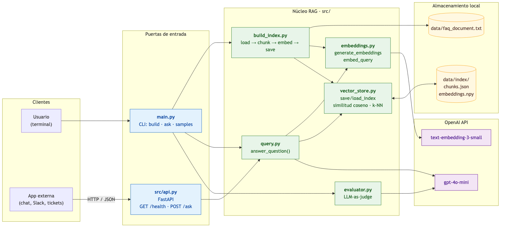
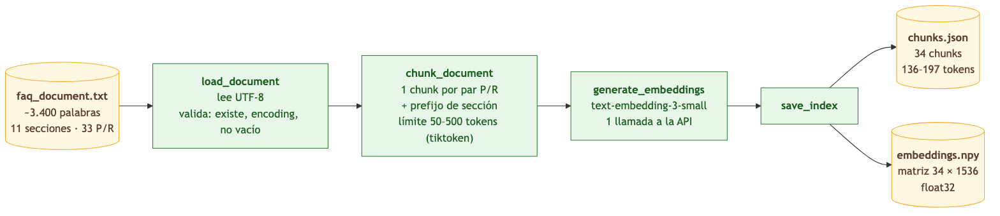
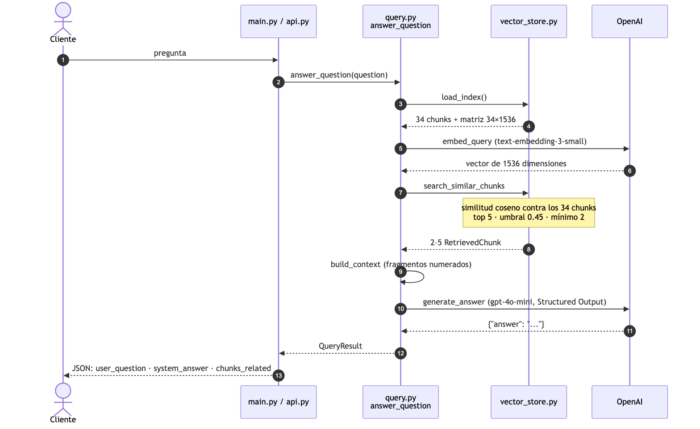
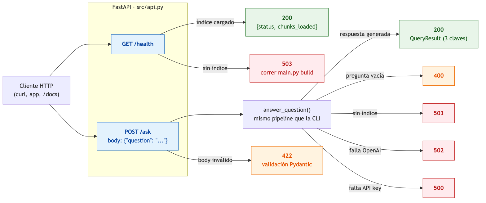

# FAQ RAG Assistant — Nexo HR

Asistente que responde preguntas frecuentes de soporte de una empresa de HR SaaS a partir de su documentación interna, usando **RAG (Retrieval-Augmented Generation)**. Devuelve un JSON con la pregunta, la respuesta y los fragmentos del documento que la respaldan.

```bash
python main.py ask "¿Cuántos días de vacaciones tengo?"
```

```json
{
  "user_question": "¿Cuántos días de vacaciones tengo?",
  "system_answer": "La cantidad de días depende de la política de vacaciones que tu empresa te asignó y de tu antigüedad. La política estándar de Nexo HR otorga: 14 días corridos hasta 5 años de antigüedad, 21 días entre 5 y 10 años, ...",
  "chunks_related": [
    {"chunk_id": 10, "section": "Vacaciones y licencias", "similarity": 0.6863, "text": "Vacaciones y licencias\nP: ¿Cuántos días de vacaciones me corresponden?\nR: ..."},
    {"chunk_id": 11, "section": "Vacaciones y licencias", "similarity": 0.5857, "text": "..."}
  ]
}
```

## El problema

El equipo de soporte recibe más de 200 preguntas repetitivas por día que ya están respondidas en la documentación (`data/faq_document.txt`: 11 secciones, 33 pares pregunta/respuesta, ~3.400 palabras). El asistente las responde de forma automática y siempre indica de qué fragmentos sacó la respuesta.

## Por qué RAG

Un LLM solo no conoce las políticas internas de Nexo HR: si se le pregunta directamente, inventa plazos o precios que suenan plausibles. RAG lo resuelve en **dos pasos**:

1. **Recuperar**: buscar en la documentación los fragmentos más parecidos a la pregunta (búsqueda vectorial con embeddings).
2. **Generar**: pasarle al LLM solo esos fragmentos y pedirle que responda usando exclusivamente esa información.

Beneficios:

- **Respuestas fundamentadas**: el modelo responde con datos del documento, no con su memoria. Si la información no está, dice "No encontré esa información en la documentación de Nexo HR." en vez de inventar.
- **Trazabilidad**: cada respuesta incluye los chunks usados y su similitud, así que se puede verificar.
- **Actualización sin reentrenar**: si cambia la documentación, se vuelve a indexar (unos segundos); no hay que entrenar ningún modelo.
- **Costo**: al LLM le llegan 2–5 fragmentos (~800 tokens), no el documento entero.

## Arquitectura

### Componentes



Hay dos **puertas de entrada**, la CLI (`main.py`) y la API HTTP (`src/api.py`). Las dos llaman a la misma función `answer_question`, así que responden igual. El **núcleo RAG** vive en `src/`: una función por etapa, con OpenAI solo para los embeddings y la generación. El índice se guarda en **archivos locales**, sin base de datos.

### Pipeline de indexación (una vez)

`python main.py build`



### Pipeline de consulta (cada pregunta)

`python main.py ask "..."` o `POST /ask`



El paso de **recuperar** va del 3 al 8: embeber la pregunta y buscar los chunks más parecidos. El de **generar** va del 9 al 11: armar el contexto y pedirle la respuesta al LLM. El evaluador (bonus) se ejecuta después, sobre el `QueryResult`, con `--evaluate` o `python main.py samples`.

> Los diagramas se generan desde archivos Mermaid en `docs/diagrams/`. Para regenerarlos: `npx @mermaid-js/mermaid-cli -i docs/diagrams/architecture.mmd -o docs/images/architecture.png -b white -s 2`. También se pueden abrir en draw.io con *Arrange → Insert → Advanced → Mermaid*.

| Archivo | Responsabilidad |
|---|---|
| `src/config.py` | Rutas, parámetros y lectura de variables de entorno (`os.getenv`) |
| `src/schemas.py` | Modelos Pydantic: `Chunk`, `RetrievedChunk`, `QueryResult`, `Evaluation` |
| `src/build_index.py` | Pipeline de indexación: una función por etapa |
| `src/embeddings.py` | Llamadas a la API de embeddings de OpenAI (lo usan ambos pipelines) |
| `src/vector_store.py` | Guardar/cargar el índice y búsqueda por similitud coseno |
| `src/query.py` | Pipeline de consulta: `answer_question(question) -> QueryResult` |
| `src/evaluator.py` | Agente evaluador (LLM-as-judge) |
| `src/samples.py` | Preguntas de ejemplo y chequeo de relevancia por palabras clave |
| `src/api.py` | API HTTP con FastAPI: `GET /health`, `POST /ask` |
| `main.py` | CLI: `build`, `ask`, `samples` |

## Instalación

Requiere Python 3.11+ y una API key de OpenAI.

```bash
python -m venv .venv
source .venv/bin/activate
pip install -r requirements.txt
cp .env.example .env        # y completar OPENAI_API_KEY
```

Variables de entorno (`.env`):

| Variable | Obligatoria | Default |
|---|---|---|
| `OPENAI_API_KEY` | Sí | — |
| `EMBEDDING_MODEL` | No | `text-embedding-3-small` |
| `OPENAI_MODEL` | No | `gpt-4o-mini` |

## Uso

```bash
python main.py build                                              # 1. construir el índice
python main.py ask "¿Cómo solicito vacaciones?"                   # 2. preguntar
python main.py ask "¿Cuánto cuesta el plan Business?" --evaluate  # con puntaje del evaluador
python main.py samples                                            # regenerar outputs/
python -m pytest                                                  # tests (sin llamadas a OpenAI)
```

Salida de `build`:

```
Chunks: 34
Tokens per chunk: min 136, max 197, avg 161
Out of range [50-500]: none
Embeddings: 34 vectors x 1536 dimensions
Vector norms: min 0.9995, max 1.0004
Index saved to .../data/index
```

Los errores se muestran en una línea clara y el programa termina con código 1: documento inexistente o con encoding inválido, API key faltante, índice no construido, pregunta vacía o fallas de la API.

### API HTTP (FastAPI)

La API es otra puerta de entrada a la misma función `answer_question` que usa la CLI, así que devuelve exactamente el mismo `QueryResult`.



```bash
uvicorn src.api:app --reload      # documentación interactiva en http://127.0.0.1:8000/docs
```

```bash
curl http://127.0.0.1:8000/health
# {"status": "ready", "chunks_loaded": 34}

curl -X POST http://127.0.0.1:8000/ask \
  -H "Content-Type: application/json" \
  -d '{"question": "¿Cuánto cuesta el plan Business?"}'
# {"user_question": "...", "system_answer": "El plan Business cuesta 8 dólares...", "chunks_related": [...]}
```

| Endpoint | Código | Cuándo |
|---|---|---|
| `GET /health` | 200 | Índice cargado (devuelve la cantidad de chunks) |
| `GET /health` | 503 | No se corrió `python main.py build` |
| `POST /ask` | 200 | Respuesta generada |
| `POST /ask` | 400 | Pregunta vacía |
| `POST /ask` | 422 | Body inválido (FastAPI lo valida con Pydantic) |
| `POST /ask` | 503 | Índice no construido |
| `POST /ask` | 502 | Falla la API de OpenAI |
| `POST /ask` | 500 | Falta `OPENAI_API_KEY` en el servidor |

## Decisiones técnicas

### Chunking: por estructura del documento

El documento tiene una estructura fija (`## Sección`, `P:` pregunta, `R:` respuesta), así que el chunking la aprovecha: **un chunk por par pregunta/respuesta**, más uno para el encabezado y la introducción.

- **Pregunta y respuesta van juntas.** Si estuvieran separadas, el chunk de la pregunta sería el más parecido a lo que escribe el usuario pero no tendría la respuesta.
- **El título de la sección va como prefijo** (`"Vacaciones y licencias\nP: ..."`). Muchas respuestas dicen "desde el módulo" sin nombrar el tema; el prefijo le da ese contexto al embedding.
- **Límites de 50–500 tokens** contados con `tiktoken` usando el encoding del modelo de embeddings. No se aproxima con palabras: en español da ~1,57 tokens por palabra, y aproximar subestimaría los chunks en más de un 50%. Si un bloque superara 500 tokens, se divide por oraciones (`split_long_text`).
- **Resultado:** 34 chunks de 136 a 197 tokens, con el 100% del texto cubierto (verificado por test línea por línea).

Alternativas descartadas: tamaño fijo con solapamiento (cortaría respuestas a la mitad) y chunking semántico (más caro y sin beneficio con un documento ya estructurado).

### Embeddings y almacenamiento

- **Modelo:** OpenAI `text-embedding-3-small`, 1.536 dimensiones. Todos los chunks se embeben en una sola llamada.
- **Almacenamiento local**, en `data/index/` (no se commitea):
  - `chunks.json`: texto y metadatos, legible.
  - `embeddings.npy`: matriz NumPy de 34 × 1.536 en float32. La fila *i* es el embedding del chunk *i*.
- Con 34 chunks no hace falta una base vectorial (FAISS, Chroma, pgvector): cargar la matriz y compararla entera toma milisegundos.

### Búsqueda: k-NN exacto con similitud coseno

La similitud se calcula explícitamente en `vector_store.cosine_similarity`:

\[ \cos(q, e_i) = \frac{q \cdot e_i}{\lVert q \rVert \, \lVert e_i \rVert} \]

`search_similar_chunks` compara la pregunta con **todos** los chunks, los ordena y se queda con:

- como máximo `TOP_K = 5`,
- solo los que tienen similitud ≥ `SIMILARITY_THRESHOLD = 0.45` (filtro por rango),
- y como mínimo `MIN_RESULTS = 2`, aunque estén por debajo del umbral.

**Calibración del umbral**, con preguntas de prueba contra el índice real:

| Tipo de chunk | Similitud observada |
|---|---|
| Chunk correcto (siempre primero) | 0,64 – 0,82 |
| Relacionados del mismo tema | 0,45 – 0,63 |
| Ruido de otros temas | 0,34 – 0,43 |
| Preguntas fuera de tema | ≤ 0,25 |

0,45 separa lo útil del ruido.

### Generación

- **Modelo:** `gpt-4o-mini` con la Responses API y **Structured Output**. El LLM solo devuelve `{"answer": "..."}`; `user_question` y `chunks_related` los arma el código, así el modelo no puede inventar chunks ni romper el formato.
- **El prompt anti-alucinación** obliga a usar solo el contexto y a responder una frase fija si la información no está.
- **`temperature=0`** para que las respuestas sean estables entre corridas.
- **`QueryResult` se valida con Pydantic:** exactamente 3 claves (`extra="forbid"`) y entre 2 y 5 chunks.

### Agente evaluador (bonus)

LLM-as-judge (`src/evaluator.py`). Recibe la pregunta, los chunks y la respuesta, y califica tres dimensiones:

| Dimensión | Puntos | Qué mide |
|---|---|---|
| Relevancia | 0–3 | ¿Los chunks recuperados sirven para responder? |
| Fidelidad | 0–4 | ¿Cada afirmación está respaldada por el contexto? (detecta alucinaciones) |
| Completitud | 0–3 | ¿La respuesta cubre todo lo que se preguntó? |

El `score` (0–10) es la **suma calculada en código**, no un número que elige el LLM, y `reason` empieza con el desglose. La evaluación se guarda aparte (`outputs/sample_evaluations.json`) para no agregarle claves al `QueryResult`.

Verificación: a una respuesta con un precio inventado ("15 dólares" en vez de 8) le dio **4/10** con fidelidad 0/4.

## Resultados

`outputs/sample_queries.json` tiene 6 ejemplos de punta a punta que cubren los tipos de pregunta del documento:

| Pregunta | Tipo | Chunks relevantes | Evaluación |
|---|---|---|---|
| ¿Cuántos días de vacaciones tengo? | Dato puntual | 5/5 | 10 |
| ¿Cómo procesa un administrador la nómina? | Cómo hacer (pasos) | 4/5 | 10 |
| ¿Puedo activar la verificación en dos pasos? | Sí/no | 2/2 | 10 |
| Me olvidé de fichar, ¿cómo lo corrijo? | Cómo hacer (pasos) | 2/2 | 10 |
| ¿Cuánto cuesta el plan Business? | Dato puntual | 3/3 | 10 |
| ¿Cuál es la capital de Francia? | Fuera de tema | — | 7 (relevancia 0: responde que no tiene la información) |

**Relevancia de la recuperación: 16/17 chunks = 94%.** Un chunk cuenta como relevante si contiene alguna de las palabras clave esperadas para esa pregunta (`src/samples.py`).

## Tests

```bash
python -m pytest     # 55 tests, ninguno llama a OpenAI
```

- Carga del documento y sus errores (inexistente, encoding inválido, vacío).
- Chunking sobre el documento real: al menos 20 chunks, todos entre 50 y 500 tokens, IDs secuenciales y 100% de cobertura.
- Similitud coseno y búsqueda con vectores de juguete de 2 dimensiones (resultados calculables a mano).
- Pipelines de embeddings, consulta y evaluador, con clientes de OpenAI falsos.
- Validación de los esquemas (3 claves, 2–5 chunks, score 0–10, reason ≥50 caracteres) y errores de la CLI.
- Endpoints de la API con el `TestClient` de FastAPI: 200, 400, 422, 502 y 503.

## Limitaciones y próximos pasos

- El chunking depende del formato `## ` / `P:` / `R:`; otro documento necesitaría otra estrategia.
- El mínimo de 2 chunks hace que, cuando solo un chunk supera el umbral, el segundo entre como relleno aunque sea poco relevante.
- El chequeo de relevancia por palabras clave es simple; el evaluador lo complementa.
- La API vuelve a leer el índice de disco en cada request; con un índice grande convendría cargarlo una vez al iniciar el servidor.
- Opcionales pendientes del plan (`docs/SPEC.md`): comparación ANN vs. k-NN y backend pgvector.
